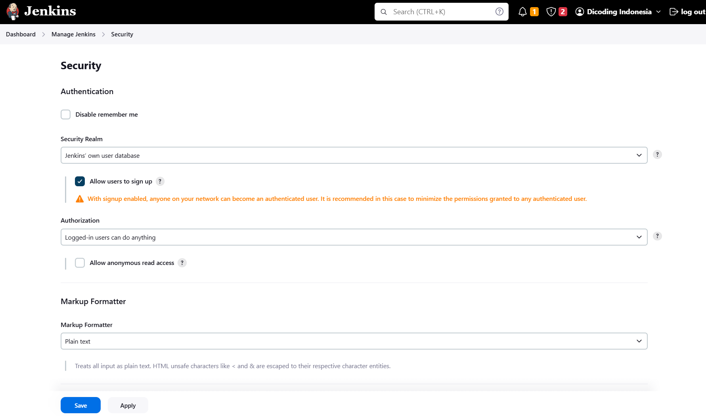
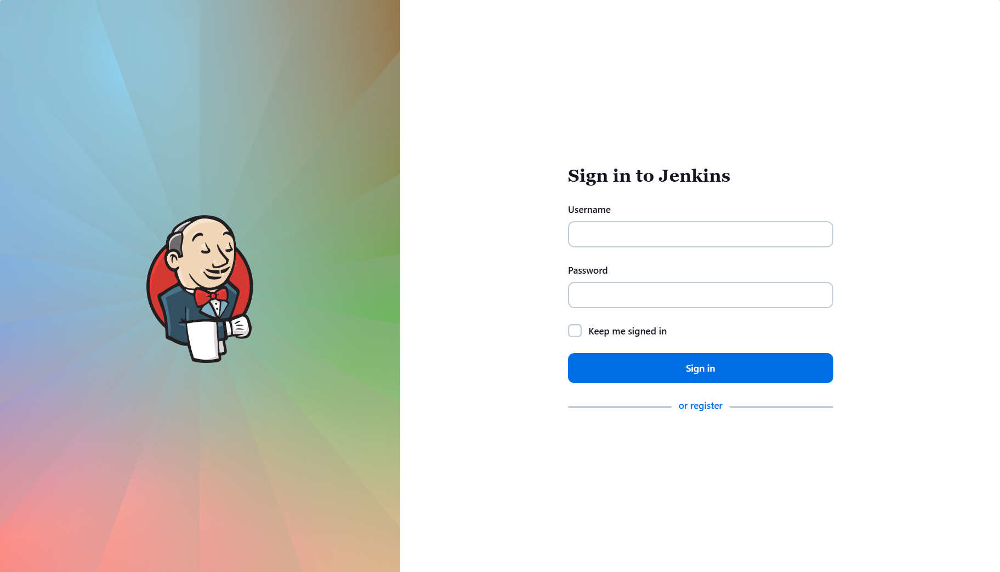
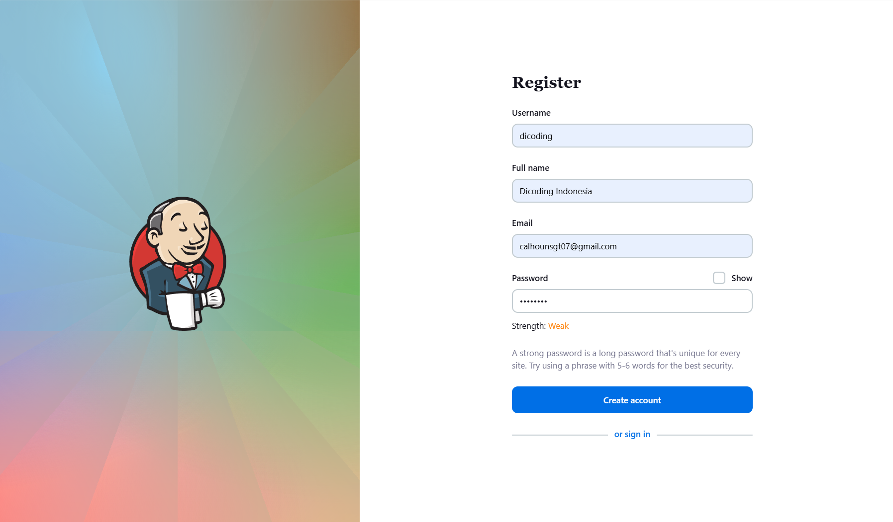
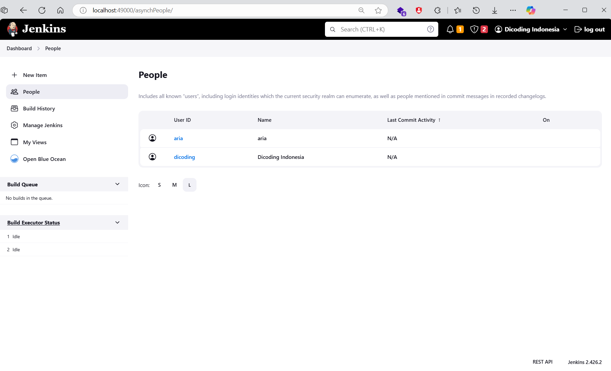
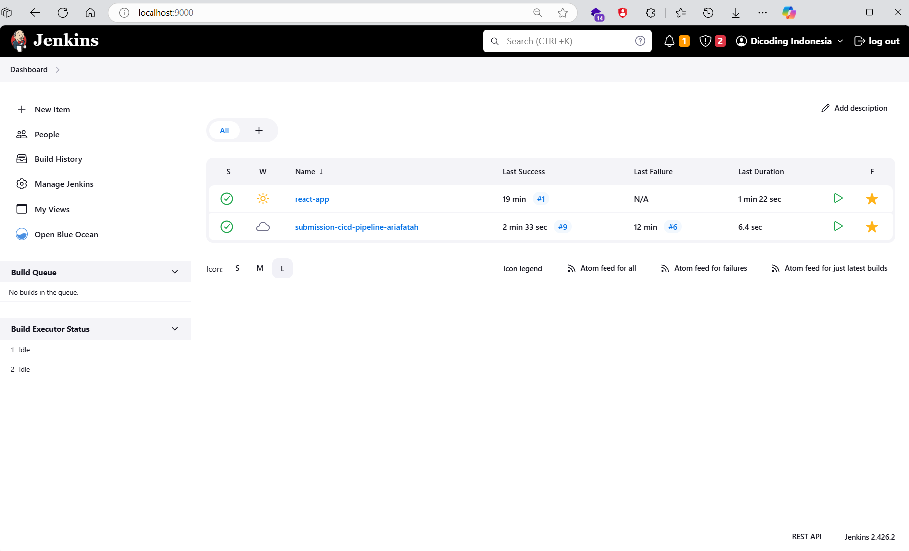
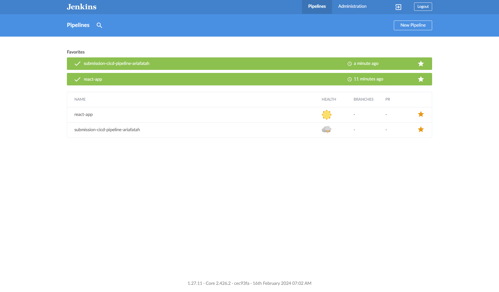
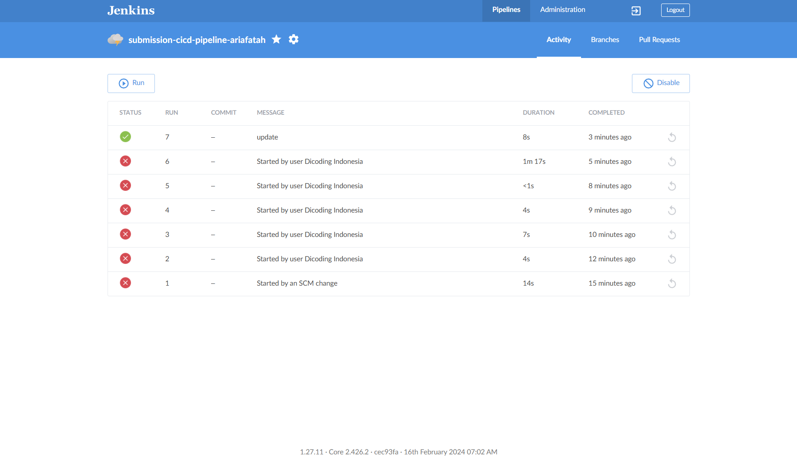
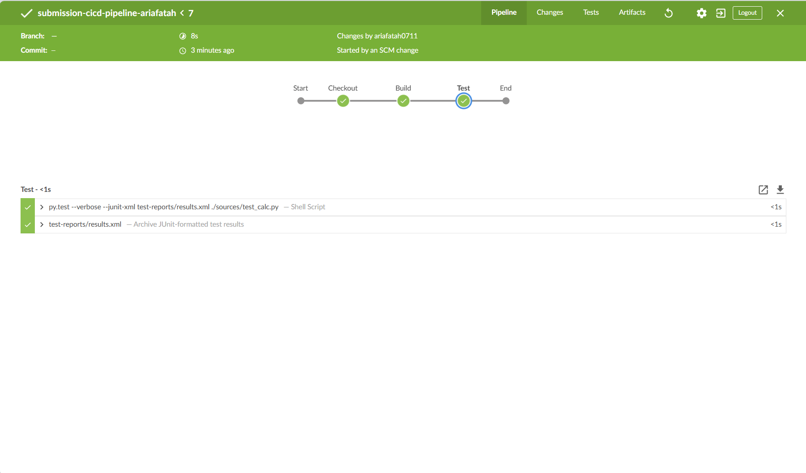
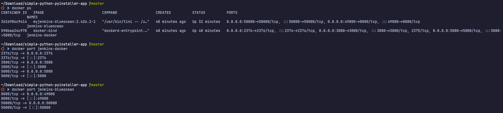
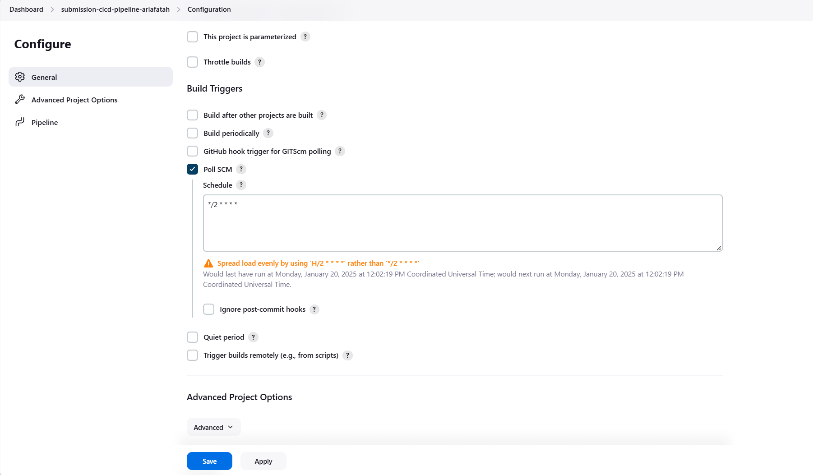

# submission 1
## 1. setup
```bash
git clone https://github.com/ariafatah0711/dicoding_7
cd dicoding_7
```

## create container (manual with nginx)
```bash

docker network create jenkins

docker run \
  --name jenkins-docker \
  --detach \
  --privileged \
  --network jenkins \
  --network-alias docker \
  --env DOCKER_TLS_CERTDIR=/certs \
  --volume jenkins-docker-certs:/certs/client \
  --volume jenkins-data:/var/jenkins_home \
  --publish 2376:2376 \
  --publish 3000:3000 --publish 5000:5000 \
  --restart always \
  docker:dind \
  --storage-driver overlay2


docker build -t myjenkins-blueocean:2.426.2-1 .

docker run \
  --name jenkins-blueocean \
  --detach \
  --network jenkins \
  --env DOCKER_HOST=tcp://docker:2376 \
  --env DOCKER_CERT_PATH=/certs/client \
  --env DOCKER_TLS_VERIFY=1 \
  --publish 49000:8080 \
  --publish 50000:50000 \
  --volume jenkins-data:/var/jenkins_home \
  --volume jenkins-docker-certs:/certs/client:ro \
  --volume "$HOME":/home \
  --restart=on-failure \
  --env JAVA_OPTS="-Dhudson.plugins.git.GitSCM.ALLOW_LOCAL_CHECKOUT=true" \
  myjenkins-blueocean:2.426.2-1 
```

## create container (with compose)
```bash
# start
docker-compose up -d

# stop
docker-compose down

# remove volume
docker-compose down -v

# remove image
docker-compose down --rmi all
```

## setup wizard
- Buka browser Anda dan jalankan http://localhost:8080. Tunggu hingga halaman Unlock Jenkins muncul.
- salin password di docker logs
  ```bash
  docker logs jenkins-blueocean
  # Jenkins initial setup is required. An admin user has been created and a password generated.
  # Please use the following password to proceed to installation:
  
  1fb5e900d96a41b6a8028dcb943a512a

  # This may also be found at: /var/jenkins_home/secrets/initialAdminPassword
  ```
- Install suggested plugins
- create user
  - Username: dicoding
  - Full name: Dicoding Indonesia
  - Email: Bebas, bisa email kedua Anda
  - Password: Bebas
- save and finish

## create pipeline
- new pipeline
  - name: submission-cicd-pipeline-ariafatah
  - type: pipeline
- configure
  - general
    <!-- - github_project: https://github.com/ariafatah0711/dicoding_7 -->
    - pool scm: */2 * * * *
  - pipeline
    - Definition: pipeline script from SCM
    - SCM: git
    - Repository url: https://github.com/ariafatah0711/dicoding_7
    - branch: */master
    - Script path: Jenkinsfile

## run
```bash
# if blueocean not in the dashboard, restart the container
docker restart jenkins-blueocean jenkins-docker
```

## images
- fitur sign up
  
  
- Tampilan halaman “Create an account!” di Jenkins.
  
- Tampilan halaman “Manage Users” di Jenkins.
  
- Tampilan halaman “Jenkins Dashboard”.
  
- Tampilan halaman “Pipelines” di Blue Ocean (react-app dan submission-cicd-pipeline-<usernamedicoding>)
  
- Tampilan halaman “Activity” di Blue Ocean untuk submission-cicd-pipeline-<usernamedicoding>.
  
- Tampilan halaman “Detail” dari proses eksekusi pipeline yang terbaru di Blue Ocean untuk submission-cicd-pipeline-<usernamedicoding> (wajib berisi tahapan Build dan Test).
  

## file log.txt
- [log.txt](./log.txt)

## link github
- https://github.com/ariafatah0711/dicoding_7

## file nginx
- [nginx.txt](./nginx.txt)

## docker ps


## build triger
