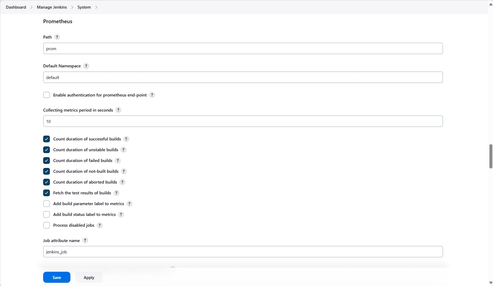

# submission 2
## setup jenkins with docker (1)
### setup container
```bash
docker network create jenkins

docker run \
  --name jenkins-docker \
  --detach \
  --privileged \
  --network jenkins \
  --network-alias docker \
  --env DOCKER_TLS_CERTDIR=/certs \
  --volume jenkins-docker-certs:/certs/client \
  --volume jenkins-data:/var/jenkins_home \
  --publish 2376:2376 \
  --publish 3000:3000 --publish 5000:5000 \
  --restart always \
  docker:dind \
  --storage-driver overlay2

docker build -t myjenkins-blueocean:2.426.2-1 .

docker run \
  --name jenkins-blueocean \
  --detach \
  --network jenkins \
  --env DOCKER_HOST=tcp://docker:2376 \
  --env DOCKER_CERT_PATH=/certs/client \
  --env DOCKER_TLS_VERIFY=1 \
  --publish 49000:8080 \
  --publish 50000:50000 \
  --volume jenkins-data:/var/jenkins_home \
  --volume jenkins-docker-certs:/certs/client:ro \
  --volume "$HOME":/home \
  --restart=on-failure \
  --env JAVA_OPTS="-Dhudson.plugins.git.GitSCM.ALLOW_LOCAL_CHECKOUT=true" \
  myjenkins-blueocean:2.426.2-1 
```

## setup all with docker compose
```bash
# start
docker-compose up -d

# stop
docker-compose down
```

### Menyiapkan Jenkins Wizard
- Buka browser Anda dan jalankan http://localhost:8080. Tunggu hingga halaman Unlock Jenkins muncul.
- salin password di docker logs
  ```bash
  docker logs jenkins-blueocean
  # Jenkins initial setup is required. An admin user has been created and a password generated.
  # Please use the following password to proceed to installation:
  
  1fb5e900d96a41b6a8028dcb943a512a

  # This may also be found at: /var/jenkins_home/secrets/initialAdminPassword
  ```
- Install suggested plugins
- create user
- save and finish

# Grafana dan Prometheus
## setup
```bash
docker rm -fv prometheus grafana

docker run -d --name prometheus -p 9091:9090 --add-host=host.docker.internal:host-gateway prom/prometheus
docker run -d --name grafana -p 3031:3031 -e "GF_SERVER_HTTP_PORT=3031" --add-host=host.docker.internal:host-gateway grafana/grafana

# docker exec -it prometheus sh
# ---
# cat >> /etc/prometheus/prometheus.yml << EOF
#   - job_name: "jenkins"                                                        
#     metrics_path: /prom                                             
#     static_configs:                                                            
#       - targets: ["host.docker.internal:49000"]
# EOF

docker exec -it prometheus sh -c 'cat >> /etc/prometheus/prometheus.yml << EOF
  - job_name: "jenkins"
    metrics_path: /prom
    static_configs:
      - targets: ["host.docker.internal:49000"]
EOF'

docker restart prometheus
```

# setup aws ec2
## setup new_user
```bash
new_user=app_python
pass="YXJpYQo="
# pass="data"

sudo useradd -m -s /bin/bash $new_user
echo "$new_user:$pass" | sudo chpasswd
echo "PasswordAuthentication yes" | sudo tee /etc/ssh/sshd_config.d/60-cloudimg-settings.conf
sudo systemctl restart ssh
sudo systemctl restart sshd

cat /var/log/auth.log | grep sshd | grep session | grep from
```

## check the app
```bash
ip=ec2-3-93-59-151.compute-1.amazonaws.com
sshpass -p "YXJpYQo=" ssh -o StrictHostKeyChecking=no app_python@$ip ls
sshpass -p "YXJpYQo=" ssh -o StrictHostKeyChecking=no app_python@$ip ./add2vals 5 10
```

## images
- Sertakan link GitHub repository yang Anda kirim saat Proyek Pertama pada kolom Catatan submission. Pastikan berkas Jenkinsfile tersedia di GitHub repository Anda.
  - [https://github.com/ariafatah0711/dicoding_7](https://github.com/ariafatah0711/dicoding_7)
- Tampilan halaman “Jenkins Dashboard”.
  
- Tampilan halaman “Detail” dari proses eksekusi pipeline yang terbaru di Blue Ocean (wajib berisi tahapan Build, Test, Manual Approval, dan Deploy).
  
- Tampilan bagian “Prometheus” pada halaman Configure Systems di Jenkins.
  
- Tampilan menu “Metric Explorer” pada halaman Prometheus
  
- Tampilan “Grafana dashboard” yang Anda buat untuk Jenkins metrics.
  

## more
- Lampirkan berkas log.txt yang Anda unduh dari halaman Artifacts pada Blue Ocean.
  - [./log.txt](./log.txt)

## saran 1-2
- Jika Anda menerapkan saran pertama dan/atau kedua; lampirkan juga screenshot yang menampilkan menu Containers pada Docker Desktop atau output dari dari perintah “docker ps” di Terminal.
  

## saran 3
### Python App dan Java App
- Lampirkan berkas System log dari EC2 instance Anda. Berkas ini dapat diunduh dari halaman EC2 -> Instances -> centang instance Anda -> Actions -> Monitor and troubleshoot -> Get system log -> Download. Itu akan mengunduh sebuah berkas dengan nama <instanceID>.log.
  - [./i-0b31d91e222b12802.log](./i-0b31d91e222b12802.log)
  - [./syslog](./syslog)
  - [./auth-sshd.log](./auth-sshd.log)